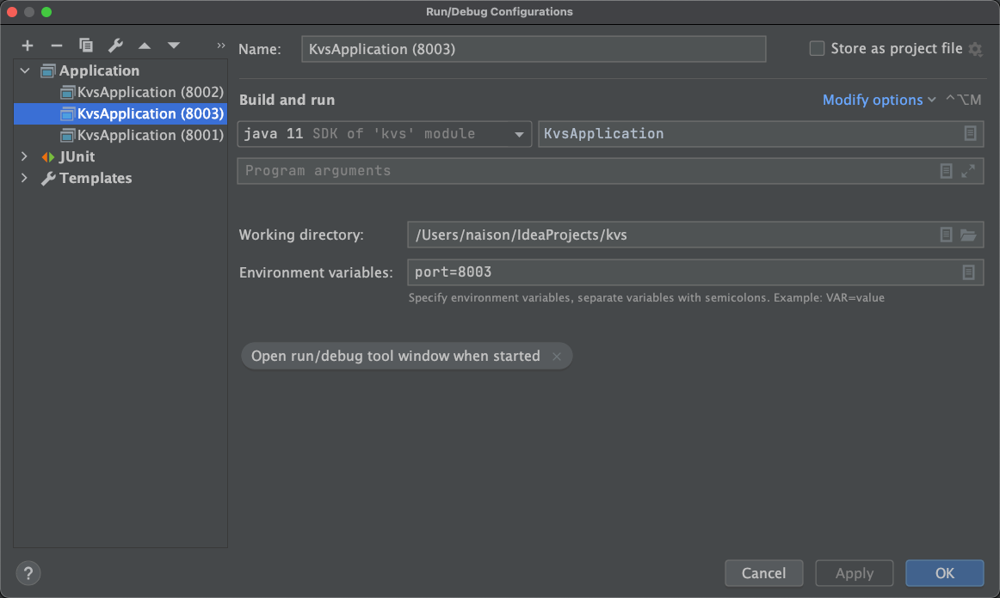
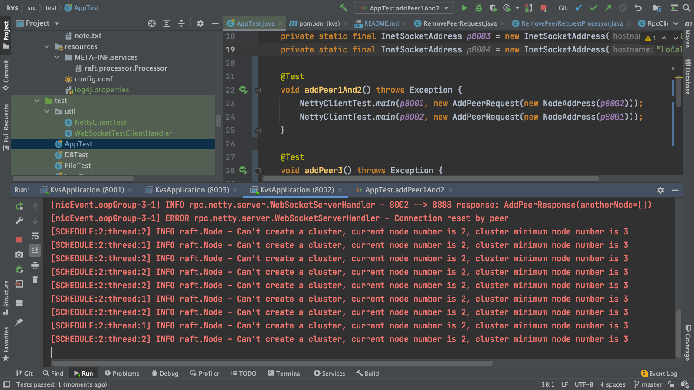

## Introduction

**Distribute key-value system, Base on Raft protocol and in memory storage, still developing**

[Reference document](https://github.com/maemual/raft-zh_cn/blob/master/raft-zh_cn.md)

## Function

### Already finished functions

- Election function
- Add/Remove cluster node dynamically

### Still developing functions

- Log synchronize
- Backup data

## How to bootstrap this project?

- Clone this project to your idea
- Run the main class KvsApplication
- Edit configurations, add environment: port=8001. (You can use any port you want)
  
  
- Copy configuration, rename and add environment: port=8002. (You can use any port you want)
  
- Copy configuration, rename and add environment: port=8003. (You can use any port you want)
  
- After Run this three configurations, find the test class AppTest.java,  run the method addPeer1And2And3()
- Open the console, you can see the log
  

## How to verify the correctness

- After elected, shutdown the follower node, cluster will work nominally
- After elected, shutdown the leader node, cluster will reelect successfully

### Step

- Bootstrap node1, node2 and node3 manually
- Find the test case class AppTest.java
- Run method addPeer1And2()
  
  this step will notify node1 and node2 each other
- Run method addPeer3() to add a peer
  
  this step will notify node2 to add a peer node3, so node2 will be leader theoretically
- Congratulations, you already learned how to add a peer to a cluster
- Run test method removePeer1() to remove peer
  
  the cluster leader will notify the followers to remove this node, and node3 will poweroff atomically, at the same
  time, the cluster keep working properly
- Enjoy, you can try to edit the nodes which one you want to add and remove dynamically
  
  
  

