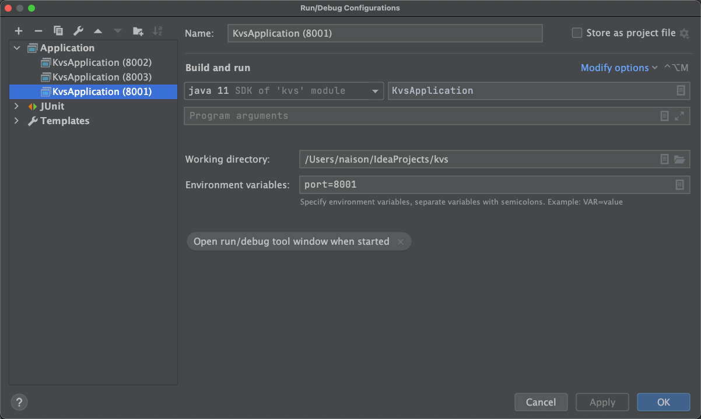
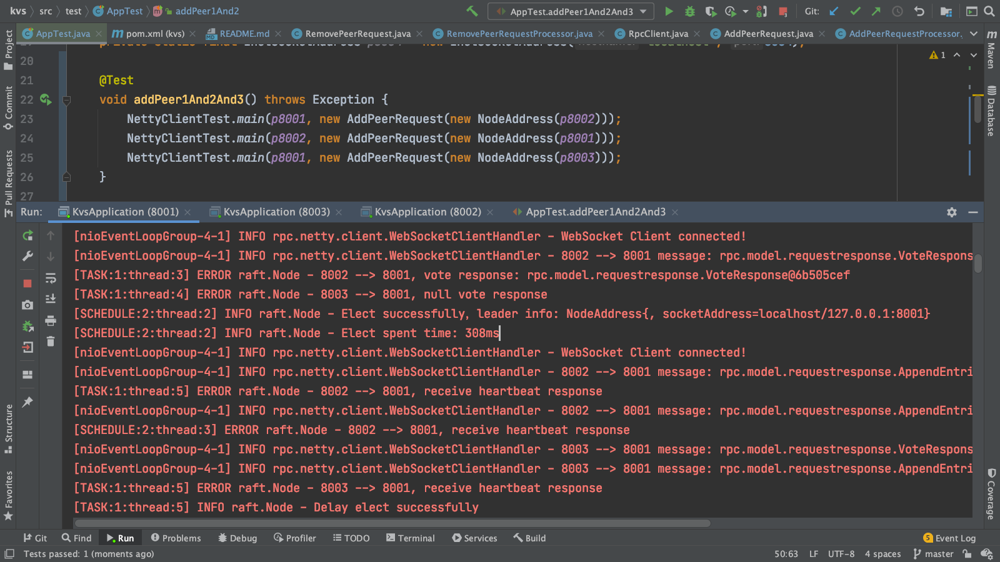

## Introduction

**Distribute key-value system, Base on Raft protocol and in memory storage, still developing**

[Reference document](https://github.com/maemual/raft-zh_cn/blob/master/raft-zh_cn.md)

## Functions

### Already finished functions

- Election function

### Still developing functions

- Add/Remove node to cluster dynamically
- Log synchronize
- Backup data

## How to bootstrap this project?

- Clone this project to your idea
- Run the main class KvsApplication
- Edit configurations, add environment: port=8001
  
- Copy configuration, rename and add environment: port=8002
  
- Copy configuration, rename and add environment: port=8003
  
- Run this three configurations
  
- Open the console, you can see the log
  
  

## How to verify the correctness
- After elected, shutdown the follower node, cluster will work nominally
- After elected, shutdown the leader node, cluster will reelect successfully

